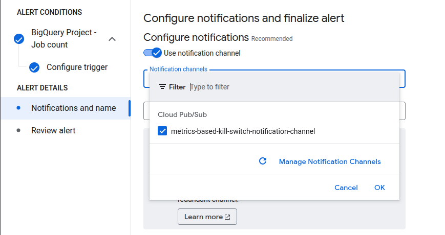
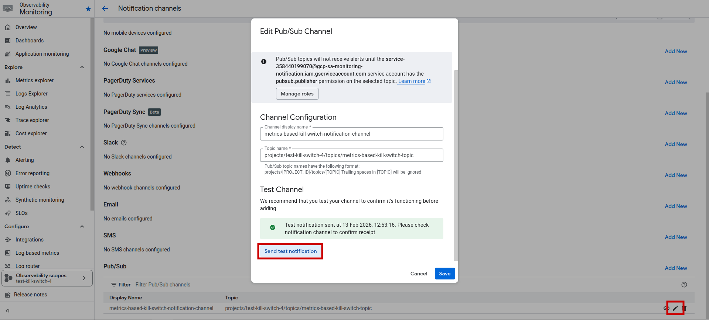

# GCP Metrics-Based Kill Switch

This Proof of Concept (PoC) replicates what is commonly done with Budget Alerts to disable a Billing Account.

However, Budget Alerts can introduce delays, which may allow a Denial of Wallet (billing bomb) scenario before the alert is triggered.

This PoC uses [Cloud Monitoring](https://docs.cloud.google.com/monitoring/docs/monitoring-overview) [Alert Policies](https://docs.cloud.google.com/monitoring/alerts) to detect resource usage anomalies and automatically disable the Billing Account when thresholds are exceeded.

# How It Works

Have `gcloud` installed and configured on your machine.

Run the script:

```
bash deploy.sh
```

Then, you can create Alert Policies in Cloud Monitoring that use the configured Pub/Sub notification channel `metrics-based-kill-switch-notification-channel`.



When an alert is triggered, the Pub/Sub topic will receive a message, which will trigger the Cloud Function to disable the Billing Account.

# ⚠️ Important Warning

**Be extremely careful.**

Any alert policy linked to the configured Pub/Sub notification channel will trigger the kill switch immediately upon threshold breach.

If an alert policy is already in a triggered state when linked to this notification channel, it will immediately disable the Billing Account.

This mechanism does not replace Budget Alerts / Budget Alert–based Kill Switch. You should always configure Budget Alerts and implement appropriate protective measures for your projects.

A kill switch is one mitigation strategy, not a complete solution.

# Testing

You can send a test message from the Notification Channel to the Pub/Sub topic to simulate an alert:



**This will trigger the kill switch and disable the Billing Account.**

# Additional Note

If you’re interested in Billing Protection / Kill Switch, feel free to check out my work on [NoBBomb](https://github.com/leo-kling/NoBBomb).